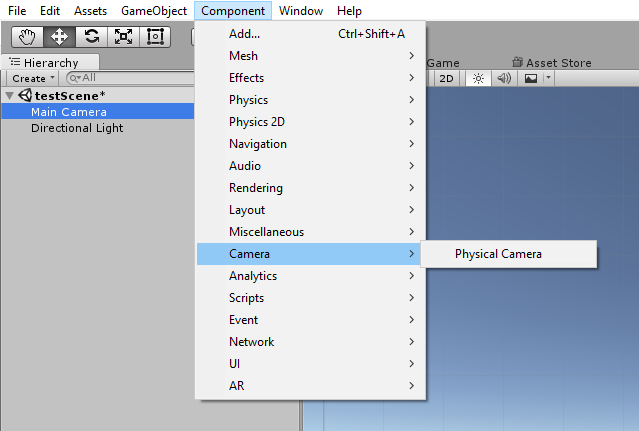

# Unity's Physical-Camera

## Overview
- A real world physical cameras model that can drive a standard Unity Camera object.

## Objectives
- Import and deliver proper lens/FOV/physical camera properties so Unity can be used in VFX and film pipelines.
- Allow people from outside the game world like cinematographers to have a familiar interface.
- Build the foundation for a proper cinematic camera component with appropriate connections to PostFX.

## Usage
- Import this package: [USDForUnity.unitypackage](https://github.com/Unity-Technologies/Physical-Camera/tree/master/Project/VFX-PhysicalCameras.unitypackage )  
- In the scene select the game object that the camera to link with the Physical Camera and add component "Camera/Physical Camera"

- Alternatively, you can drag and drop an existing physical camera prefab onto a camera object.

  

## Notes
- Many of the fields, at the moment, have no impact in Unity itself.
- Should work with Unity 5.6 and up.
- Work in progress.
- For the Physical-Camera to synch with a camera, it's needs to be explicitely linked throught it's "Associated Camera" property. This property is auto-set, when not set, to the first camera object that it find on it's parent game object.

  

## License
[MIT](USDForUnity/Assets/StreamingAssets/USDForUnity/License.txt)